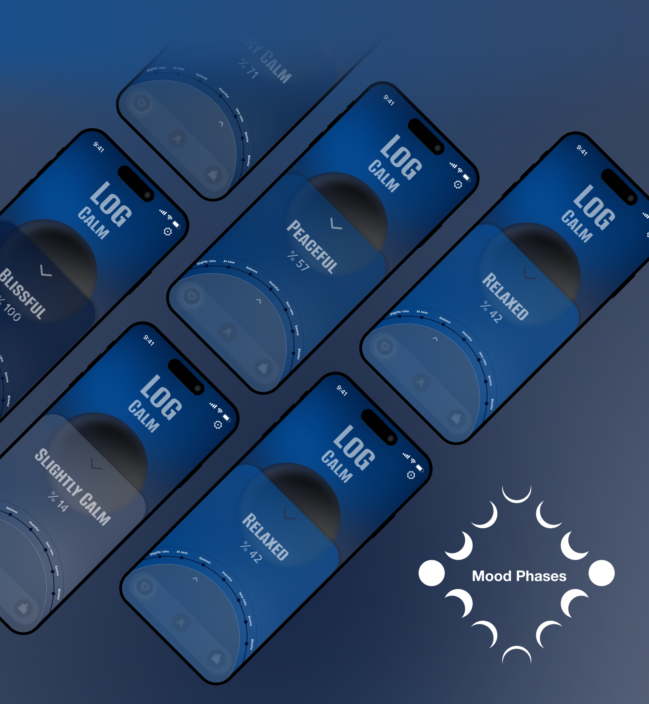

# Mood-Phases-App

## Overview
A design concept of a mood tracking app designed to help users track their emotions, 
recognize patterns over time, and develop healthier coping mechanisms.

## Process
<ul>
  <li>User research</li>
  <li>Low-fidelity Prototype</li>
  <li>Wireframing</li>
  <li>High-fidelity UI Design</li>
</ul>

## Tools
Figma

## Prototype 
View the all details on my Behance page here: https://www.behance.net/gallery/242592265/Mood-Phases 
